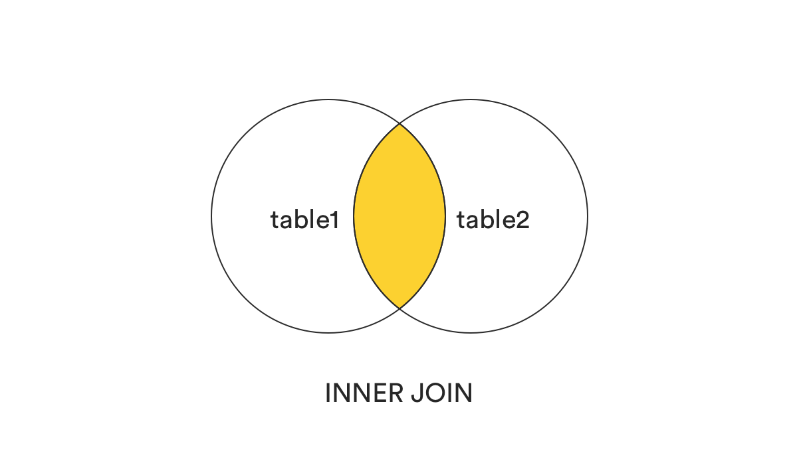
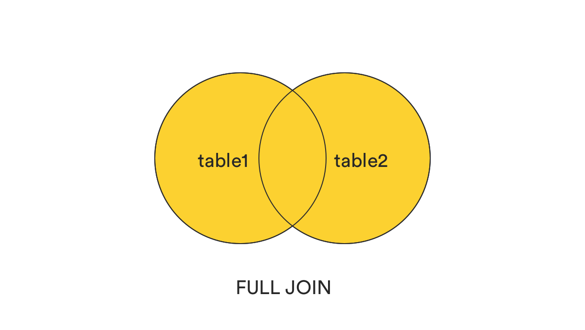
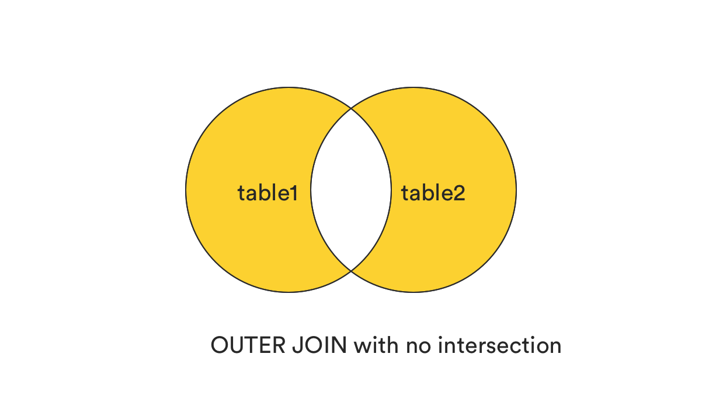
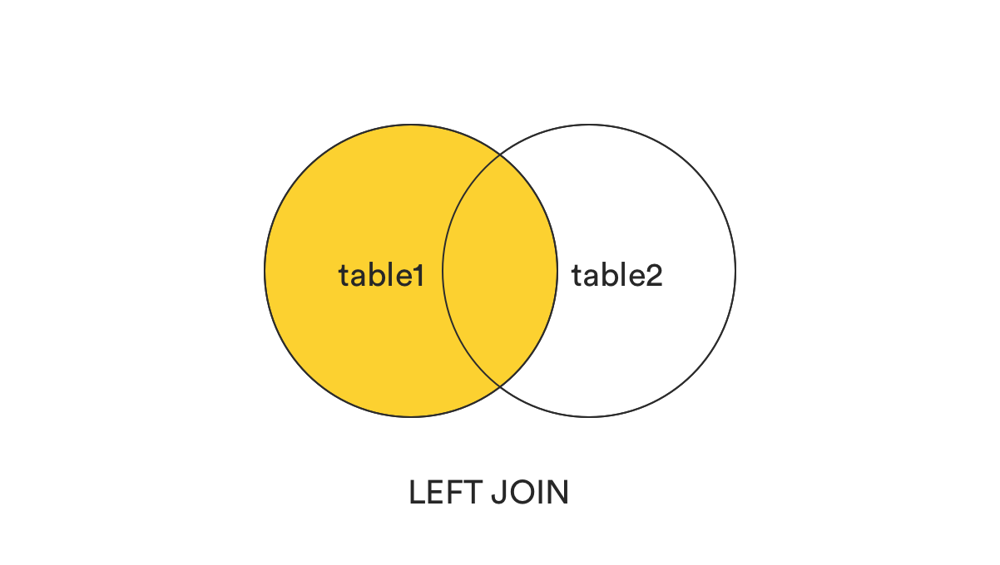
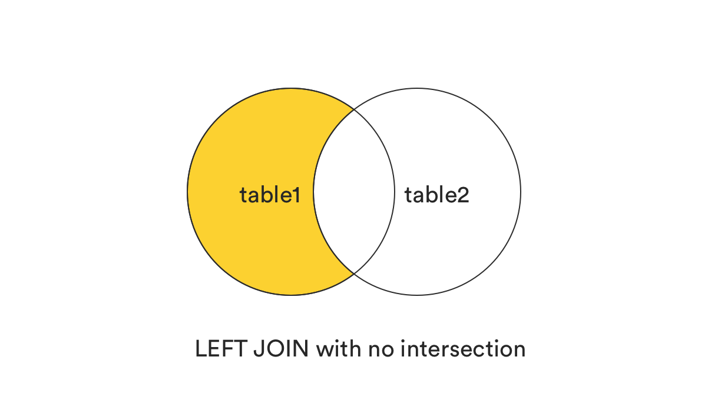
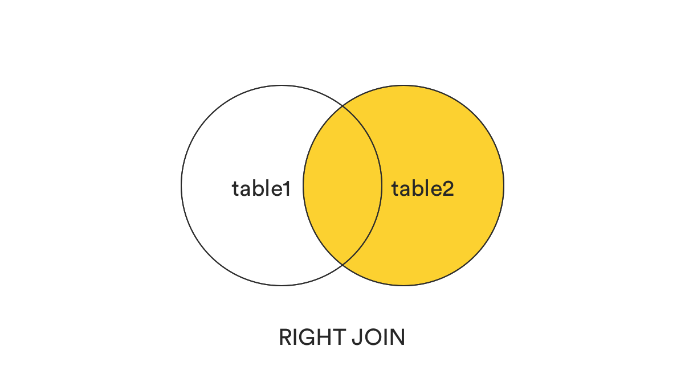
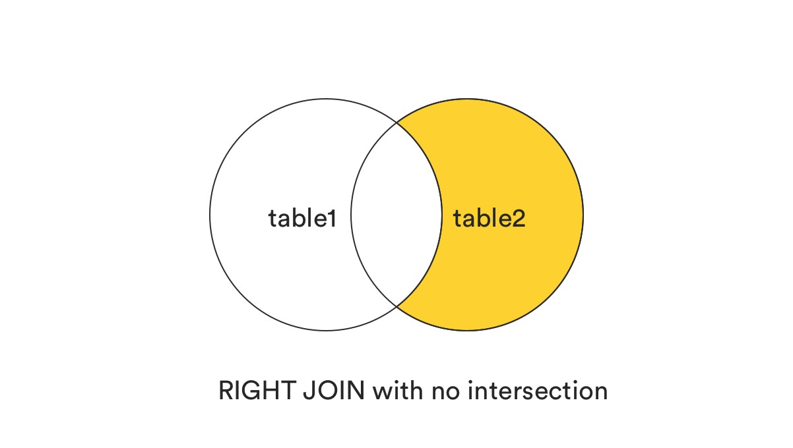

# sql_join_types.notes

## what is an sql join

these are clauses used to link data across two tables via shared columns

## the importance of joins

putting everything into a single table will bloat and slowdown database performance.
therefore, divide information into multiple tables. this will provide faster insertions and retrievals.

typically, depending on the type of `JOIN` there will be an `ON` condition that follows it. this will return all matching records

# sql JOIN types

## 1. INNER JOIN (set intersection)
returns only records that are shared by both tables on the condition

usage example: 
```sql
SELECT *
FROM table1
INNER JOIN table2
ON table1.col1 = table2.col2;
```



## 2. FULL [OUTER] JOIN (set union)
returns all records that match the on condition regardless of the table they belong to.

usage example: 
```sql
SELECT *
FROM table1
FULL JOIN table2
ON table1.col1 = table2.col2;
```



## 3. FULL [XOR] JOIN (set symmetric difference)

returns all records excluding those common to both tables. 
in effect this can be seen as `FULL JOIN - INNER JOIN`

usage example: 
```sql
SELECT *
FROM table1
FULL JOIN table2
ON table1.col1 = table2.col2
WHERE table1.col1 IS NULL
OR table1.col2 IS NULL;
```



## 4. LEFT [OUTER] JOIN (returns left table records only)
returns only left-table records that match the `ON` condition

usage example: 
```sql
SELECT *
FROM table1
LEFT JOIN table2
ON table1.col1 = table2.col2;
```



## 5. LEFT [DIFF] JOIN (set difference: left - right)
returns only left-table records that match the `ON` condition, but excludes those found in the right-table as well. in effect: `LEFT JOIN - INNER JOIN`

usage example: 
```sql
SELECT *
FROM table1
LEFT JOIN table2
ON table1.col1 = table2.col2
WHERE table2.col2 IS NULL;
```



## 6. RIGHT [OUTER] JOIN (returns right table records only)
returns only right-table records that match the `ON` condition

usage example: 
```sql
SELECT *
FROM table1
RIGHT JOIN table2
ON table1.col1 = table2.col2;
```



## 7. RIGHT [DIFF] JOIN (set difference: right - left)
returns only right-table records that match the `ON` condition, but excludes those found in the left-table as well. in effect: `RIGHT JOIN - INNER JOIN`

usage example: 
```sql
SELECT *
FROM table1
RIGHT JOIN table2
ON table1.col1 = table2.col2
WHERE table1.col1 IS NULL;
```



# summary

