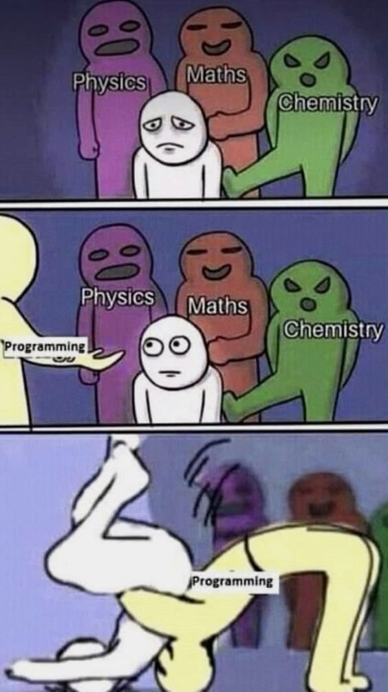

<!--
Instructions:
""" Write a blog post about everything you just learned / this project is covering. Your blog post should be articulated this way (one paragraph per item):

    introduction
    id and type
    mutable objects
    immutable objects
    why does it matter and how differently does Python treat mutable and immutable objects
    how arguments are passed to functions and what does that imply for mutable and immutable objects

Your posts should have many code/output examples to illustrate what you are explaining, and at least one picture, at the top. Publish your blog post on Medium or LinkedIn, and share it at least on LinkedIn."""
-->

# Python3 - Everythin is an Object (class essay)
&mdash; _Jos&eacute; 'Chep&eacute;' N. Olmos on Septemb:er 15, 2024_

## Introduction:
<!--
from the project objectives:
"""
what is an object
difference between a class and an object or instance
difference between immutable object and mutable object
built-in mutable and immutable types
what is a reference
what is an assignment
what is an alias
how to know if two variables are identical
how to know if two variables are linked to the same object
how to display the variable identifier (which is the memory address in the cpython implementation)
"""
-->
as it turns out, everything in python is an object. that is, according to stackoverflow, "anything that can be assigned to a variable" -- not only values, but also, functions, classes, modules, and built-in types. this excludes keywords, punctuation, and operators.[^1] and as i was told, every object in python inherits either directly or indirectly from the core `object` class. but what is a class ? that's basically a custom definition of a type, so that we're not limited to what's just out-of-the-box. classes are basically like OP `struct`s that are found in C. anyway, objects are instances of a class. to clarify the relation, a class is the blueprint, and an object is the device. this is a one-to-many relation. one definition, many instances.
id() and type(), mutable and immutable, passing variables to a function

## id() and type():
<!--
-->

## mutable objects:
<!--
-->

## immutable objecs:
<!--
-->

###	why does this distinction matter:
<!--
-->

###	how differently does python treat mutable and immutable objects:
<!--
-->

## how are arguments passed to functions:
<!--
-->

### implications for mutable and immutable objects:

[^1]: https://stackoverflow.com/questions/32083871/what-does-everything-mean-when-someone-says-everything-in-python-is-an-object
