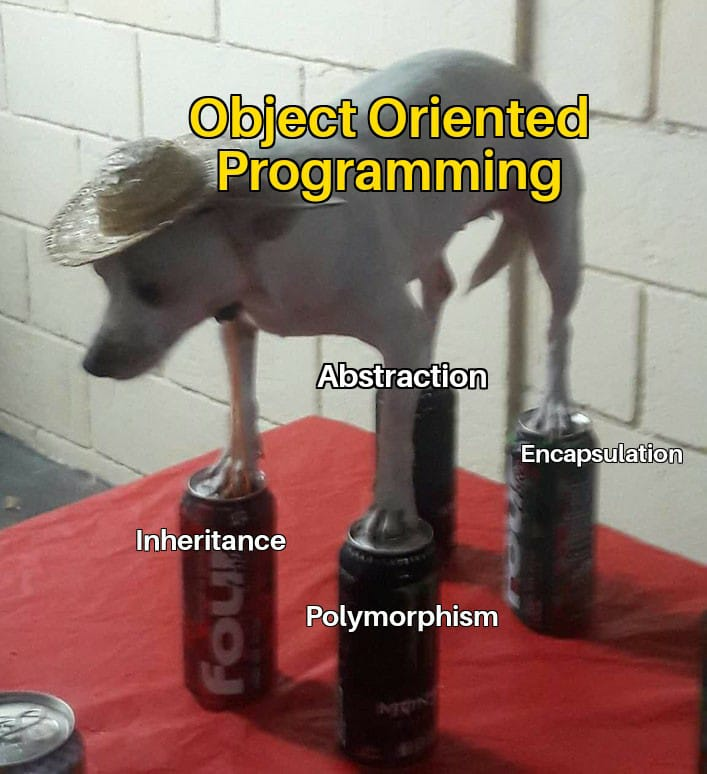

<!--

Instructions:

""" Write a blog post about everything you just learned / this project is covering. Your blog post should be articulated this way (one paragraph per item):

    introduction
    id and type
    mutable objects
    immutable objects
    why does it matter and how differently does Python treat mutable and immutable objects
    how arguments are passed to functions and what does that imply for mutable and immutable objects

If you worked on advanced tasks, please also include what yqou did learn in those tasks in the blog post.

Your posts should have many code/output examples to illustrate what you are explaining, and at least one picture, at the top. Publish your blog post on Medium or LinkedIn, and share it at least on LinkedIn."""

-->
# Python3 -- Everythin is an Object (Class Essay)
&mdash; _Jos&eacute; 'Chep&eacute;' N. Olmos_ September 15, 2024

## Introduction:
<!--
from the project objectives:
"""
what is an object
what is the difference between a class and an object or instance
what is the difference between immutable object and mutable object
what is a reference
what is an assignment
what is an alias
how to know if two variables are identical
how to know if two variables are linked to the same object
how to display the variable identifier (which is the memory address in the cpython implementation)
what is mutable and immutable
what are the built-in mutable types
what are the built-in immutable types
how does python pass variables to functions
"""
-->
## id() and type():
<!--
-->
## mutable objects:
<!--
-->
## immutable objecs:
<!--
-->
###	why does this matter:
<!--
-->
###	how does python treat these two kinds of objects:
<!--
-->
## how arguments are passed to functions:
<!--
-->
###in relation to mutable and immutable objects:

